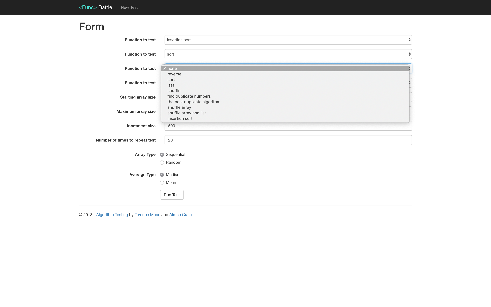
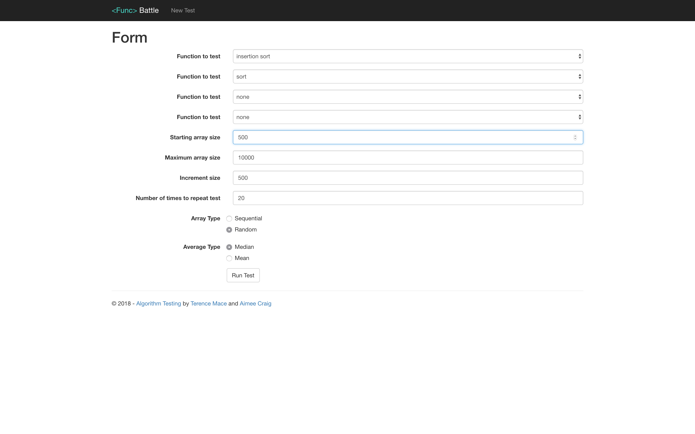
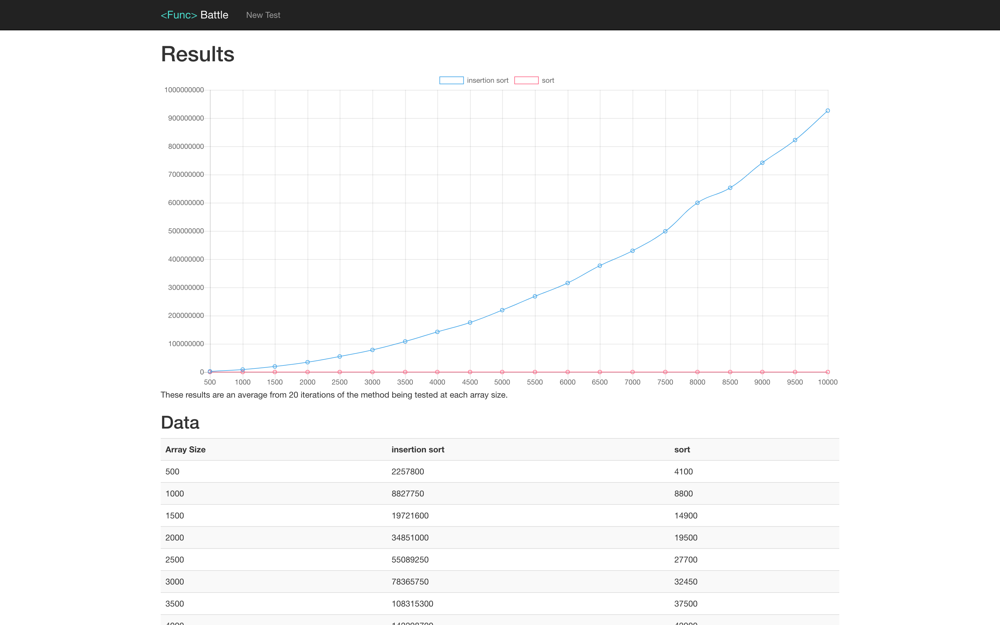

# Algorithmic Complexity #
The challenge outline for this repository can be found [here](https://github.com/makersacademy/course/tree/master/algorithmic_complexity).

## Prerequisites ##
* Visual Studio Community 2017
* [.NET Core 2.1 SDK](https://dotnet.microsoft.com/download/thank-you/dotnet-sdk-2.1.500-macos-x64-installer)

## How to Use ##
1. Clone the repository
```bash
git clone https://github.com/Tolvic/algorithmic-complexity.git
```

2. Navigate into the AlgorithmTesting folder within the repository
```bash
cd algorithmic-complexity/AlgorithmTesting
```

3. Run the application
```bash
dotnet run
```

4. Access the program from [localhost:5001](`localhost:5001`)

5. Amend the speed test using the instructions below

### Testing an Algorithm

The application can run up to 4 tests simultaneously and compare the results on the same graph and table.

1. Navigate to the new test page

2. Pick your functions from the first four drop down menus.


3. Set the parameters of the test (i.e. array size, increment size, number of time to repeat test).


4. Click Run Test.

The results will display like below:


### Running Unit Tests ###
1. Navigate into the AlgorithmTesting.Tests folder within the repository
```bash
cd algorithmic-complexity/AlgorithmTesting.Tests
```

2. Run the unit tests using the following command
```bash
dotnet test
```

## SpeedTest Function

Pseudo code for how we anticipate this working:
```
Test(FunctionToBeTested, StartArraySize, MaxArraySize, incrementSize, NbTimesTestsRepeated){
  results = new Hash
  i = StartArraySize
  n = 1  

  for (n; while n <= NoTimesTestsRepeated; n++){

    results[i] = new Array

    for (i; while i<= MaxArraySize; i += incrementSize){
      testArray = setup(i)

      var startTime = time.now

      FunctionToBeTested(testArray)

      var timeTaken = time.now - startTime

      results[i] << timeTaken

      tearDown()
    }  
  }

  removeUpperLowerBounds()
  averageResults()
  return results;
}

setup(arraySize){
  return array(1... arraySize).shuffle
}

tearDown(){
  # If there is anything that needs tearing down after each test it would be handled here
  # possible clear memory?
}
```

Results hash will be structured as follows:
```
{
  arraySize[0]{result1, result2, ...},
  arraySize[1]{result1, result2, ...},
  arraySize[2]...
}
```

and will resemble the below prior to averaging or removing upper and lower bounds.
```
Results {
  10 => {
    0.02, 0.03, 0.02
  }
  20 => {
    0.02, 0.03, 0.02
  }
  30 => {
    0.02, 0.03, 0.02
  }
}
```

This looks like it will be useful for setting up the function in C#:

https://stackoverflow.com/questions/2082615/pass-method-as-parameter-using-c-sharp

Also, the test result will show time in nanoseconds.

## Todo ##
- [x] Pseudo code
- [x] Set up Environment
  - [x] Set up MVC 5 architecture
  - [x] .gitignore
  - [x] strip out superficial pages
  - [x] Set up routes
- [x] Create a testing class
- [x] Set up results view
- [x] Set up method to pass existing functions into SpeedTest
- [x] Test the following functions:
  - [x] Last
  - [x] Reverse
  - [x] Shuffle
  - [x] Sort
- [ ] Create algorithms
  - [x] Find duplicate values
    - [x] Write unit test
    - [x] Write algorithm
    - [x] Run SpeedTest
    - [x] Plot graph
  - [x] Shuffle
    - [x] Write unit test
    - [x] Write algorithm
    - [x] Run SpeedTest
    - [x] Plot graph
  - [ ] Reverse
    - [ ] Write unit test
    - [ ] Write algorithm
    - [ ] Run SpeedTest
    - [ ] Plot graph
  - [ ] Mechacoach pairing
    - [ ] Write unit test
    - [ ] Write algorithm
    - [ ] Run SpeedTest
    - [ ] Plot graph
  - [ ] Most frequent words
    - [ ] Write unit test
    - [ ] Write algorithm
    - [ ] Run SpeedTest
    - [ ] Plot graph
  - [ ] Sorting 0 and 1s
    - [ ] Write unit test
    - [ ] Write algorithm
    - [ ] Run SpeedTest
    - [ ] Plot graph
  - [ ] Sub-sequence sum
    - [ ] Write unit test
    - [ ] Write algorithm
    - [ ] Run SpeedTest
    - [ ] Plot graph

## Nice to Have ##
- [x] User interface to configure SpeedTest parameters
- [x] Plot multiple functions on the same graph
- [ ] Remove outliers (top and bottom 5%)
- [x] Add name of method being tested to graph
- [x] Label axis of graph and show unit type

## Contributors
* [Aimée Craig](https://github.com/aimeecraig/)
* [Terry Mace](https://github.com/Tolvic)
